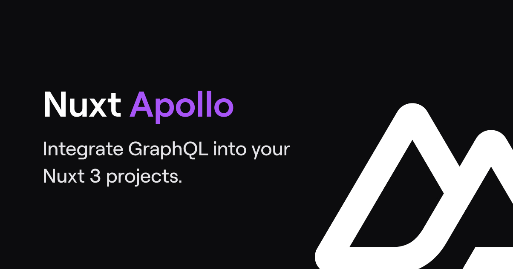

<h1 align="center">Nuxt Apollo</h1>

Effortlessly integrate GraphQL into your Nuxt 3 projects.

  <!--  -->
  
  
  
  
  
  

<!-- - [Documentation](https://apollo.nuxtjs.org) -->

## Development

- Clone this repository
- Ensure you have the latest LTS version of Node.js installed
- Run `corepack enable`
- Install dependencies using `pnpm install`
- Start playground with `pnpm dev`

## License

[MIT License](./LICENSE)
